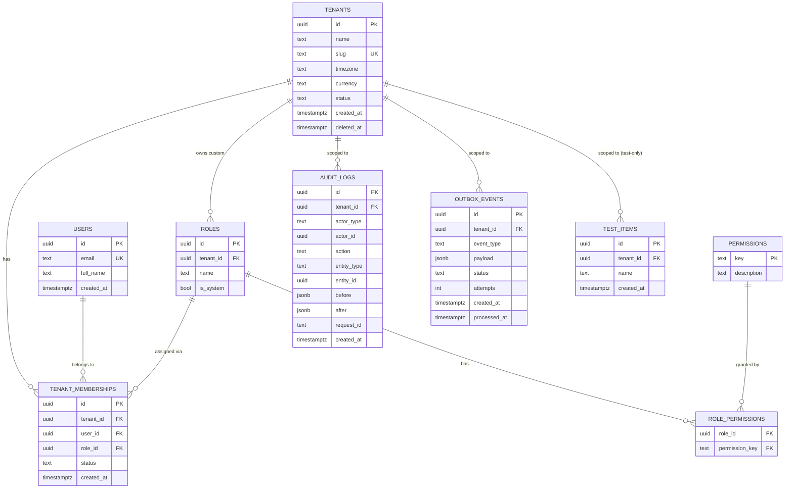

# ERD for MVP

```mermaid
erDiagram
  TENANTS {
    uuid id PK
    text name
    text slug UK
    text timezone
    text currency
    text status
    timestamptz created_at
    timestamptz deleted_at
  }
  USERS {
    uuid id PK
    text email UK
    text full_name
    timestamptz created_at
  }
  ROLES {
    uuid id PK
    uuid tenant_id FK
    text name
    bool is_system
  }
  PERMISSIONS {
    text key PK
    text description
  }
  ROLE_PERMISSIONS {
    uuid role_id FK
    text permission_key FK
  }
  TENANT_MEMBERSHIPS {
    uuid id PK
    uuid tenant_id FK
    uuid user_id FK
    uuid role_id FK
    text status
    timestamptz created_at
  }
  AUDIT_LOGS {
    uuid id PK
    uuid tenant_id FK
    text actor_type
    uuid actor_id
    text action
    text entity_type
    uuid entity_id
    jsonb before
    jsonb after
    text request_id
    timestamptz created_at
  }
  OUTBOX_EVENTS {
    uuid id PK
    uuid tenant_id FK
    text event_type
    jsonb payload
    text status
    int attempts
    timestamptz created_at
    timestamptz processed_at
  }
  TEST_ITEMS {
    uuid id PK
    uuid tenant_id FK
    text name
    timestamptz created_at
  }

  TENANTS ||--o{ TENANT_MEMBERSHIPS : "has"
  USERS ||--o{ TENANT_MEMBERSHIPS : "belongs to"
  ROLES ||--o{ TENANT_MEMBERSHIPS : "assigned via"
  ROLES ||--o{ ROLE_PERMISSIONS : "has"
  PERMISSIONS ||--o{ ROLE_PERMISSIONS : "granted by"
  TENANTS ||--o{ ROLES : "owns custom"
  TENANTS ||--o{ AUDIT_LOGS : "scoped to"
  TENANTS ||--o{ OUTBOX_EVENTS : "scoped to"
  TENANTS ||--o{ TEST_ITEMS : "scoped to (test-only)"
```
